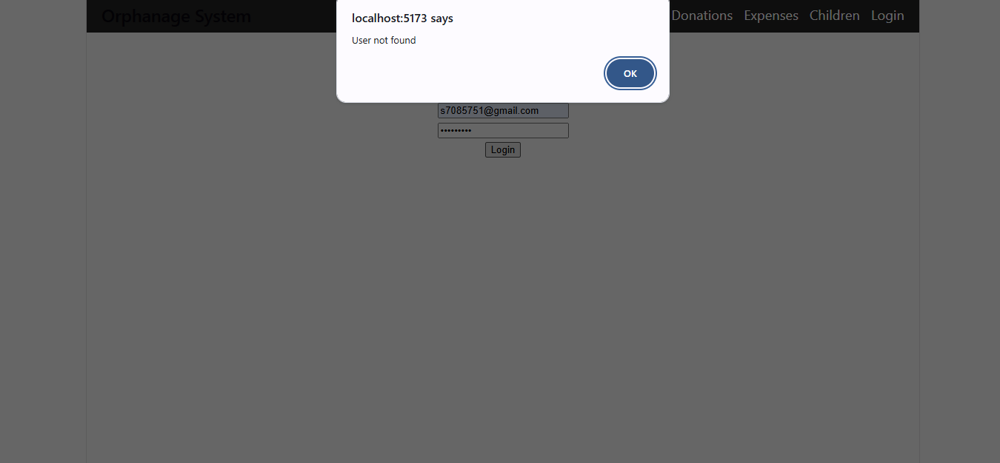
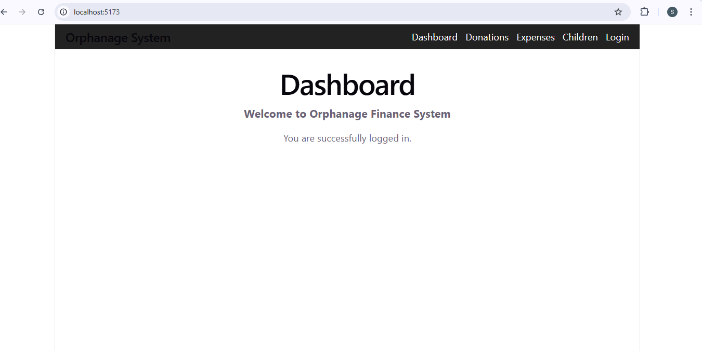
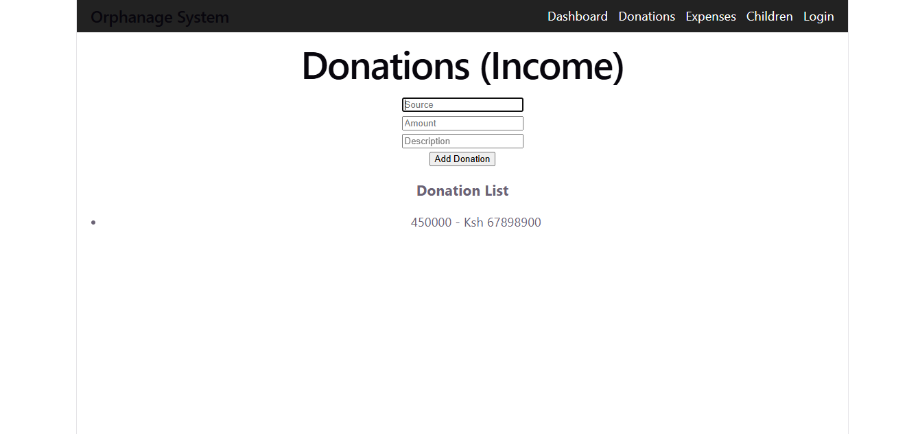
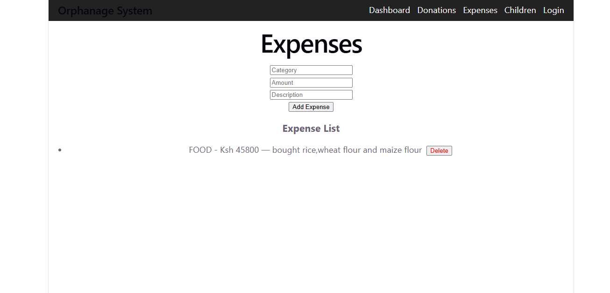
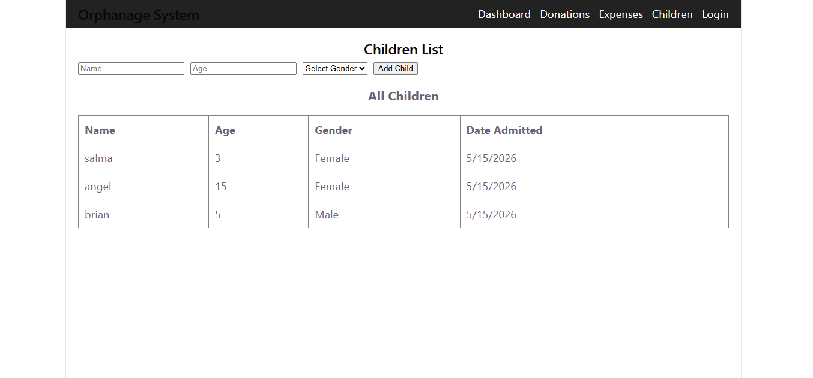

# 🏠 Orphanage Finance Management System
A full-stack web application for managing orphanage operations including donations, expenses, children records, and financial reports.

## 🌐 Live Demo
Frontend: [Add your Vercel URL here]     
API: [Add your Render URL here]

## 🚀 Features
User authentication (JWT-based login/register)  
Donations tracking and management  
Expenses monitoring with balance calculations  
Children profiles and records  
Dashboard with statistics and reports  
Responsive design for all devices

## 🛠 Tech Stack
Frontend: React 18, Vite, React Router  
Backend: Node.js, Express   
Database: MongoDB, Mongoose  
Authentication: JWT, bcrypt  
Deployment: Vercel (Frontend), Render (Backend)

## ⚙️ Getting Started

### Prerequisites
Node.js 18+
MongoDB Atlas account

### Installation
1.Clone the repository
git clone https://github.com/lucywachu77-dev/orphanage-finance-management-system.git  
cd orphanage-finance-management-system

2.Install backend dependencies  
cd backend   
npm install

3.Install frontend dependencies  
cd ../frontend  
npm install

4.Set up environment variables     
cp .env.example .env

5.Run development servers  
cd backend && npm run dev

cd frontend && npm run dev

## 📡 API Endpoints

### Auth
POST /api/auth/register - Register user  
POST /api/auth/login - Login user  
GET /api/auth/me - Get current user

### Donations
GET /api/donations - Get all donations  
POST /api/donations - Create donation  
PUT /api/donations/:id - Update donation  
DELETE /api/donations/:id - Delete donation

### Expenses
GET /api/expenses - Get all expenses  
POST /api/expenses - Create expense  
PUT /api/expenses/:id - Update expense  
DELETE /api/expenses/:id - Delete expense  

### Children
GET /api/children - Get all children  
POST /api/children - Add child  
PUT /api/children/:id - Update child info  
DELETE /api/children/:id - Remove child

## 🖼 Screenshots
| Page      | Preview                                 |
| --------- | --------------------------------------- |
| Login     |          |
| Dashboard |  |
| Donations |  |
| Expenses  |    |
| Children  |    |

## 👥 Contributors
| Name         | Role                | Contribution                                |
| ------------ | ------------------- | ------------------------------------------- |
| Lucy         | Team Lead           | Project management, integration, deployment |
| Moureen      | Authentication      | Login/Register, JWT auth, protected routes  |
| Martin       | Donations           | Donation form, list, edit/delete            |
| Dollar       | Expenses            | Expense form, list, balance calculations    |
| Patrick      | Dashboard           | Statistics cards, charts, reports           |
| Naomi        | Children Management | Children profiles, edit, list/cards         |
| Julie & Mary | UI/Styling          | Navbar, Footer, CSS, responsiveness         |
| Ester        | Testing             | Bug fixes, error handling, testing          |
| Salma        | Documentation       | README, screenshots, contributors           |

## 📄 License
This project was created for educational purposes as part of IYF Weekend Academy Season 10.

## 📝 Notes
Make sure MongoDB is running before starting the backend  
Do not push .env or node_modules to GitHub  
Always pull latest changes before pushing.